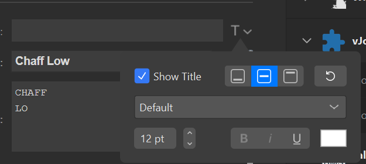

# Falcon 4 BMS SharedMem Plugin for Stream Deck

A Streamdeck Plugin that will display information from Falcon 4 BMS's Shared Memory resources.

## Installation Instructions
* Download the .streamDeckPlugin and run it to install into your StreamDeck.

## Current Features
* ### CMDS Panel
	* Display Flare and Chaff Counts.
	* Display Flare and Chaff Low Warning text.
		* Text boxes to customize Warning text.  Currently the settings show on all buttons, but it will only affect the text of the current button if the Warning option is selected.
	* Display Current CMDS Mode (OFF/STBY/MAN/SEMI/AUTO/BYP)

All Display formatting is done with the default StreamDeck Title formatting options. 

> [!WARNING]
> Any text placed in the Title text box will be override the plugin information, so it must be blank to work.

## Useful Things
Icons that can be used for the buttons located under the src/Images folder

Flare Icon

Chaff Icon

## TODO
* Only show the Low Warning text boxes when those options are selected

## Future Roadmap
* Ability to use the buttons as hotkeys to trigger BMS keybinds. EX: add the keybind to the CMDS Mode button to cycle the mode in BMS

## Helpful Tools
* [StreamDeck-Joy](https://github.com/ashupp/Streamdeck-vJoy) - To bind vJoy buttons to bind DX keybinds in BMS. So you can use the StreamDeck to toggle switches.

## Dependencies
* [BarRaider's StreamDeck-Tools](https://github.com/BarRaider/streamdeck-tools)
* F4SharedMem library from [Lightning Viper's Lightning Tools](https://github.com/lightningviper/lightningstools)

